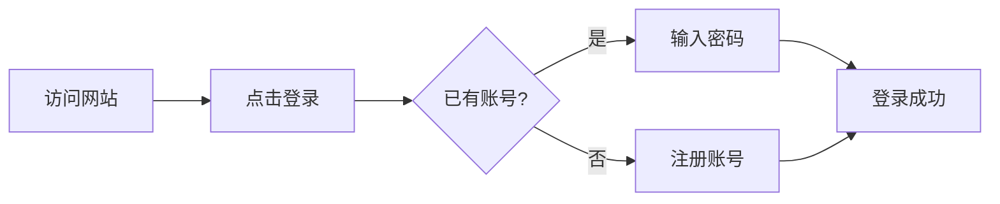
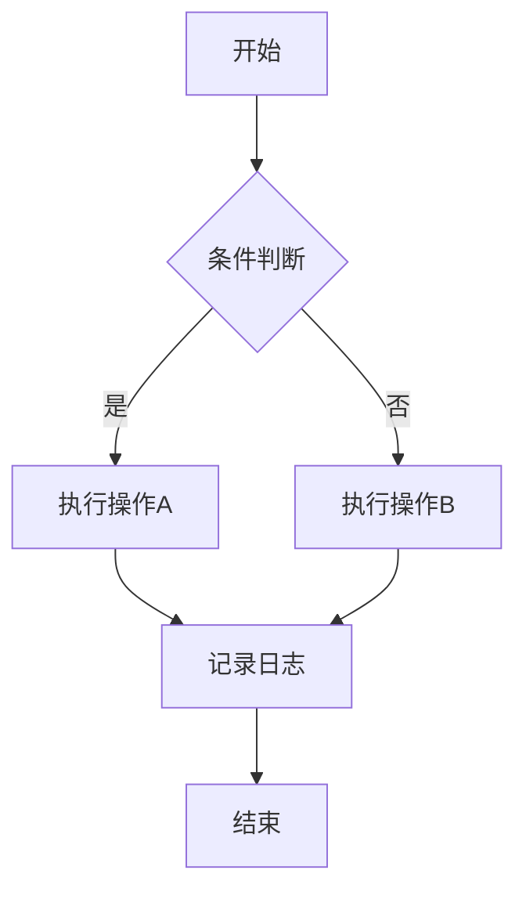
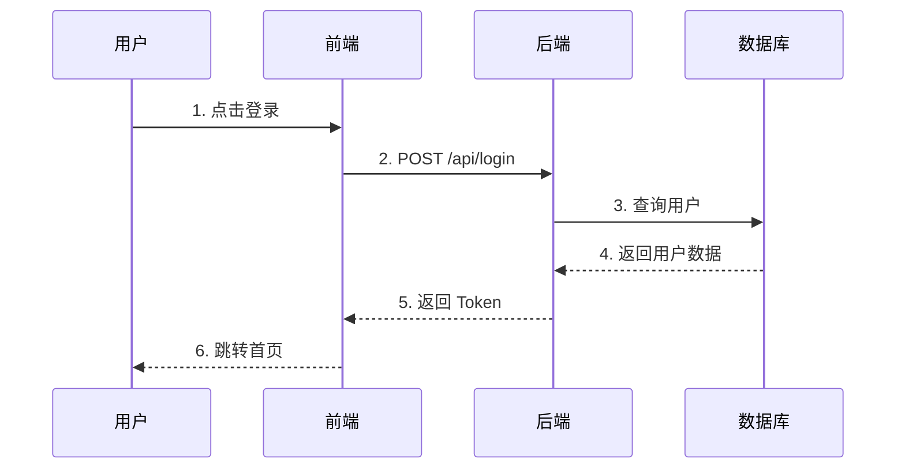
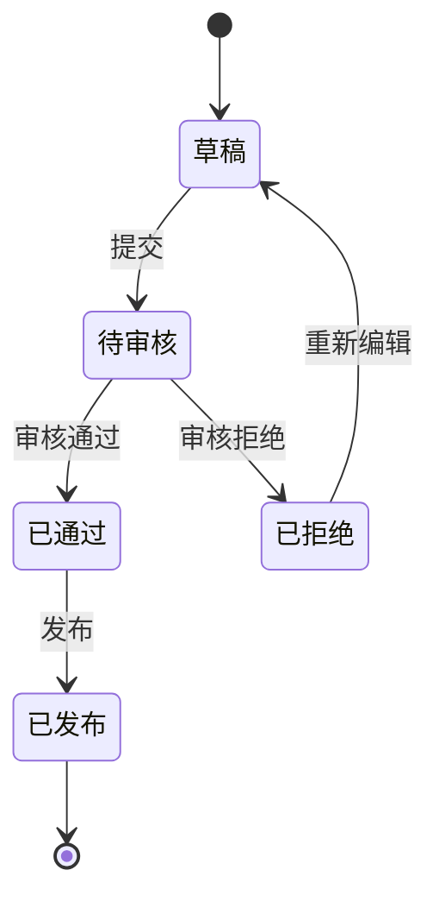
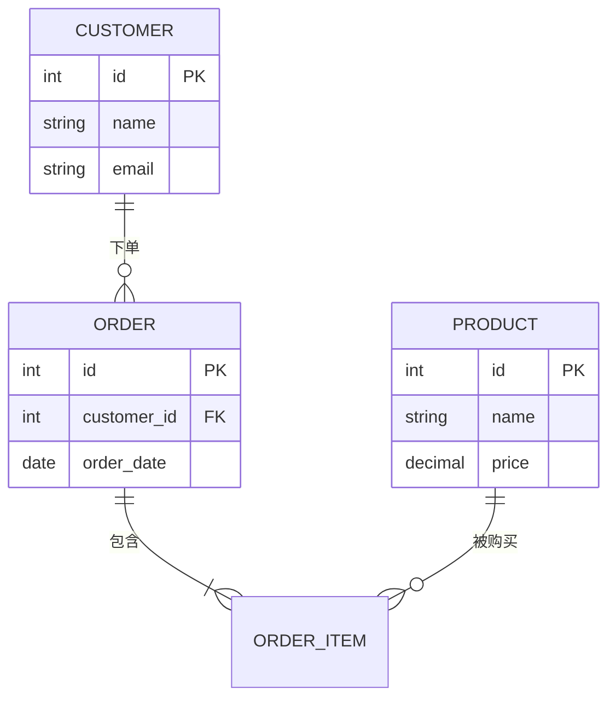
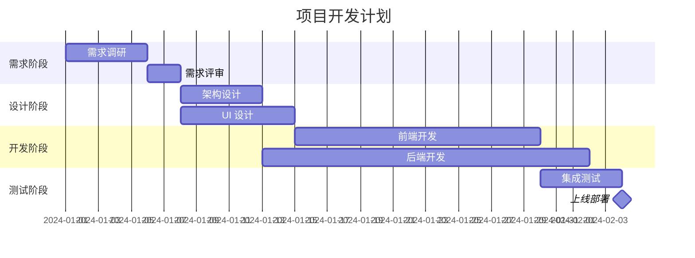
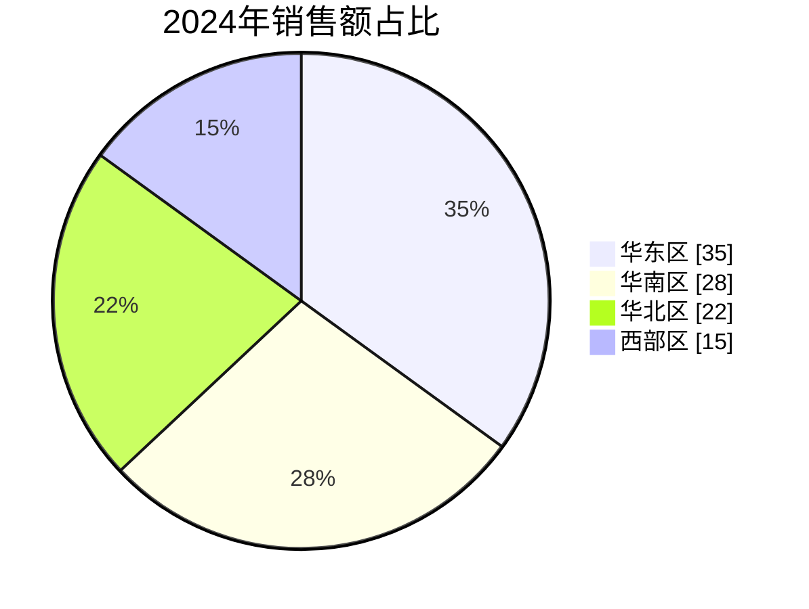
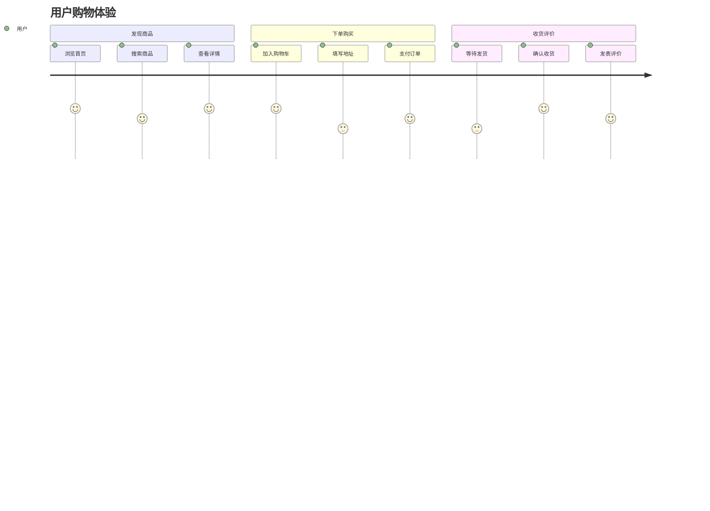
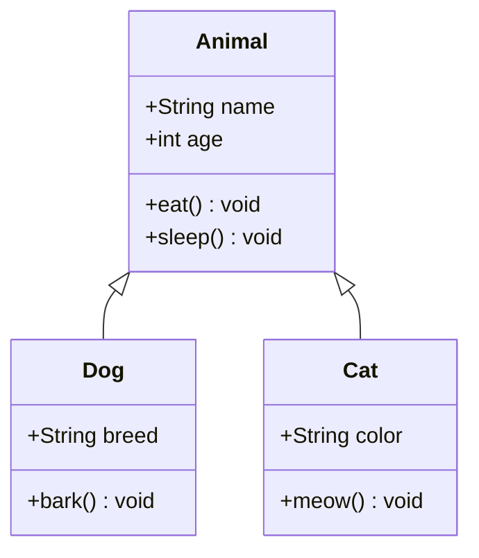
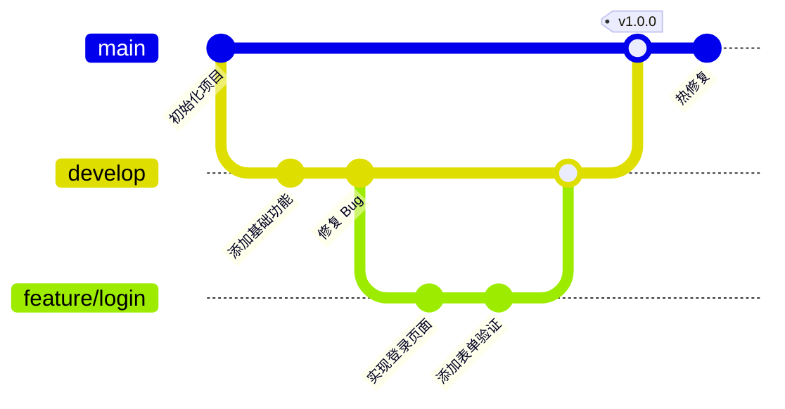

# 图表使用指南

本文档介绍知识库支持的各种图表类型及其使用方法。

## 图表容器功能

所有图表都支持两种显示模式：

1. **普通模式** - 使用 ` ```mermaid ` 代码块，直接嵌入文档
2. **容器模式** - 使用 ` ```mermaid-box ` 代码块，带工具栏（缩放、全屏、复制）

### 容器模式示例



---

## 思维导图 (Markmap)

适用于知识结构、概念梳理、学习路径等场景。

```markmap
# 知识库功能
## 企业应用
### 金蝶 ERP
### CRM 系统
### OA 办公
## AI 应用
### 智能财务
### 智能 PPT
## 知识学习
### 大模型基础
### Prompt 工程
```

**语法说明：**
- 使用 Markdown 标题层级表示节点关系
- `#` 为根节点，`##` 为一级分支，以此类推

---

## 流程图 (Flowchart)

适用于业务流程、决策逻辑、操作步骤等场景。



**语法说明：**
- `TD` 表示从上到下，`LR` 表示从左到右
- `[]` 矩形，`{}` 菱形，`()` 圆角矩形，`(())` 圆形
- `-->` 实线箭头，`-.->` 虚线箭头

---

## 时序图 (Sequence Diagram)

适用于 API 调用、系统交互、消息传递等场景。



**语法说明：**
- `participant` 定义参与者
- `->>` 实线箭头，`-->>` 虚线箭头
- `Note over A,B: 文字` 添加注释

---

## 状态图 (State Diagram)

适用于状态机、工作流状态、订单状态等场景。



**语法说明：**
- `[*]` 表示开始/结束状态
- `状态A --> 状态B: 事件` 定义状态转换

---

## ER 图 (Entity Relationship)

适用于数据库设计、实体关系建模等场景。



**语法说明：**
- `||--o{` 一对多关系
- `||--|{` 一对多（必须）
- `PK` 主键，`FK` 外键

---

## 甘特图 (Gantt)

适用于项目计划、时间线、里程碑等场景。



**语法说明：**
- `section` 分组
- `after a1` 表示在任务 a1 之后
- `milestone` 里程碑

---

## 饼图 (Pie)

适用于数据占比、分布统计等场景。



**语法说明：**
- `showData` 显示数值
- `"标签" : 数值` 定义数据

---

## 用户旅程图 (User Journey)

适用于用户体验分析、流程优化等场景。



**语法说明：**
- `section` 阶段分组
- `任务: 满意度(1-5): 角色`

---

## 类图 (Class Diagram)

适用于代码架构、对象关系、设计模式等场景。



**语法说明：**
- `+` 公有，`-` 私有，`#` 保护
- `<|--` 继承，`*--` 组合，`o--` 聚合

---

## Git 分支图 (Gitgraph)

适用于 Git 分支策略、版本管理等场景。



**语法说明：**
- `branch` 创建分支
- `checkout` 切换分支
- `merge` 合并分支
- `tag` 添加标签

---

## 快速参考

| 图表类型 | 代码块标识 | 容器模式 | 适用场景 |
|---------|-----------|---------|---------|
| 思维导图 | `markmap` | ✅ 自带容器 | 知识结构、概念梳理 |
| 流程图 | `mermaid` | `mermaid-box` | 业务流程、决策逻辑 |
| 时序图 | `mermaid` | `mermaid-box` | API 调用、系统交互 |
| 状态图 | `mermaid` | `mermaid-box` | 状态机、工作流 |
| ER 图 | `mermaid` | `mermaid-box` | 数据库设计 |
| 甘特图 | `mermaid` | `mermaid-box` | 项目计划、时间线 |
| 饼图 | `mermaid` | `mermaid-box` | 数据占比 |
| 用户旅程 | `mermaid` | `mermaid-box` | 用户体验分析 |
| 类图 | `mermaid` | `mermaid-box` | 代码架构 |
| Git 图 | `mermaid` | `mermaid-box` | 分支策略 |

## 容器模式使用说明

使用 `mermaid-box` 代替 `mermaid` 即可启用容器模式，支持：

- 🔍 **缩放** - 放大/缩小/重置
- 📋 **复制** - 一键复制图表代码
- 🖥️ **全屏** - 全屏查看，ESC 退出

可选添加标题：` ```mermaid-box{title="图表标题"} `
