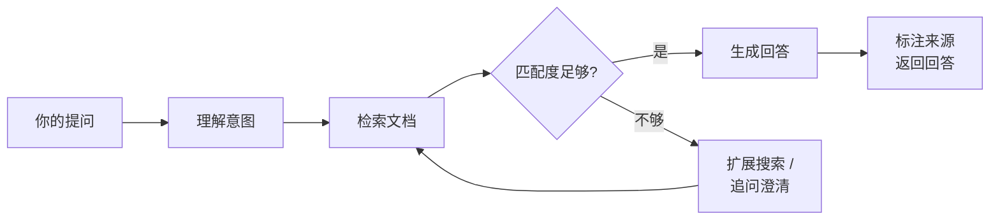

# AI 智能问答

知识库内置 AI 问答功能：用自然语言提问，AI 自动检索相关文档并生成回答，附带来源引用。

## 背后的原理

当你提问时，AI 会执行以下流程：



- **理解意图** — 分析问题，提取关键实体和搜索方向
- **检索文档** — 在你有权限的空间和目录中语义搜索，找到最相关的内容片段
- **评估质量** — 判断匹配度，不足时自动扩展搜索或追问你澄清
- **生成回答** — 基于检索到的内容组织回答，标注每段信息的来源

**知识库中的文档质量直接决定 AI 回答的质量。** 文档越完整、结构越清晰，AI 给出的回答就越准确。

## 使用入口

在页面右上角点击**问一问康康**按钮，打开 AI 问答对话窗口。

【占位：AI 问答入口按钮截图】

## 基本用法

### 提出问题

在对话框中输入问题，按回车发送。AI 会自动检索并生成回答。

【占位：AI 问答对话界面截图】

### 查看来源

回答中的上标引用（如 [1] [2]）标注了信息来源。点击可跳转到原始文档，方便核实。

【占位：引用上标 + 来源列表截图】

### 多轮追问

同一个会话中可以继续追问，AI 会结合上下文理解你的意图：

```
你：报销流程是什么？
AI：根据财务部文档，报销流程分为以下步骤…… [1]

你：金额超过 5000 的需要谁审批？
AI：根据《费用审批权限表》，超过 5000 元需要部门总监审批…… [2]
```

## 提问技巧

### 有效的提问方式

| 方式 | 示例 |
|------|------|
| 具体明确 | "金蝶系统中如何创建销售订单？" |
| 带上场景 | "新员工入职第一天需要办理哪些手续？" |
| 限定范围 | "采购部的供应商评估标准是什么？" |
| 操作类 | "如何在 OA 中提交请假申请？" |

### 避免的提问方式

| 提问 | 问题 | 建议 |
|------|------|------|
| "帮帮我" | 太模糊 | 描述具体问题 |
| "所有制度" | 范围太大 | 缩小到具体制度 |
| "今天天气" | 超出知识库范围 | 只问知识库中有的内容 |

## AI 也在用这个知识库

FORCOME 知识库不仅服务于人，也是公司各类 AI 智能体的知识来源：

| AI 场景 | 如何使用知识库 |
|---------|---------------|
| 问一问康康 | 检索文档回答员工提问 |
| 康康写作 | 读取当前页面上下文辅助创作 |
| 业务 Agent | 接入知识库 API 获取业务规则和操作指南 |

当你补充或完善一篇文档时，所有依赖这个知识库的 AI 都会立刻"学到"这些内容。

## 注意事项

- AI 只能基于知识库中**已有的文档**回答，未录入的内容无法回答
- 涉及重要决策时，请点击来源链接核实原始文档
- 如果 AI 提示"相关文档不足"，说明该主题的内容尚未收录到知识库
- 每次提问建议控制在 2000 字以内
