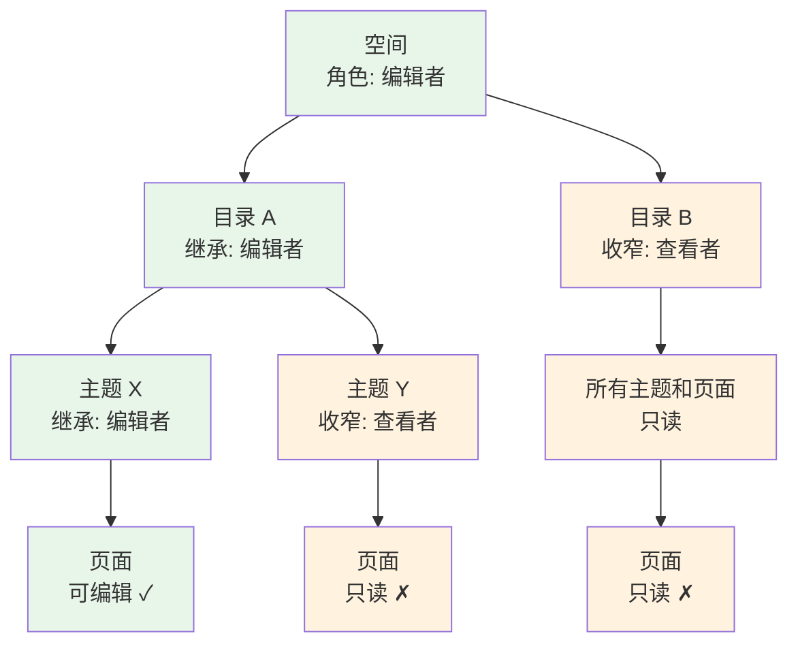

# 协作与权限

FORCOME 知识库支持多人实时协作编辑，并通过四级权限体系保障文档安全。

## 登录方式

知识库仅对公司内部开放，使用**钉钉账号一键登录**：

1. 打开知识库地址
2. 点击**钉钉登录**按钮
3. 使用钉钉扫码或输入钉钉账号授权

【占位：钉钉登录页面截图】

登录后自动获得所分配的空间和权限，无需额外申请账号。

## 内容组织层级

知识库的内容按四级层次组织，权限沿层级继承：

```
工作区（Workspace）— 整个知识库
 └── 空间（Space）— 业务域或部门
      └── 目录（Directory）— 分类文件夹
           └── 主题（Topic）— 子分类标签
                └── 页面（Page）— 文档内容，可嵌套子页面
```

| 层级 | 用途 | 示例 |
|------|------|------|
| 空间 | 按部门或业务域划分的独立区域 | "IT 服务"、"财务"、"企业应用" |
| 目录 | 空间内的分类文件夹 | "网络管理"、"金蝶 ERP"、"报销制度" |
| 主题 | 目录下的子分类标签 | "VPN 配置"、"财务模块"、"差旅报销" |
| 页面 | 实际文档，支持多级子页面 | "VPN 申请操作手册"、"凭证录入指南" |

## 实时协作

### 多人同时编辑

多人可以同时打开并编辑同一篇文档。每个人的光标以不同颜色显示，并标注姓名。

【占位：多人协作编辑截图，展示不同颜色的光标和姓名】

### 自动保存

所有编辑内容**实时自动保存**，断网后重新连接会自动同步。

### 评论

选中文档中的一段文字，可以添加评论：

- 审校意见 — 指出需要修改的地方
- 讨论确认 — 对某个观点进行讨论
- 任务标记 — 标注待办事项

【占位：添加评论的操作截图】

## 权限体系

### 权限角色

每个层级（空间、目录、主题）可以独立分配以下角色：

| 角色 | 查看 | 评论 | 编辑 | 管理 |
|------|:----:|:----:|:----:|:----:|
| 查看者 | ✓ | — | — | — |
| 评论者 | ✓ | ✓ | — | — |
| 编辑者 | ✓ | ✓ | ✓ | — |
| 所有者 | ✓ | ✓ | ✓ | ✓ |

### 权限继承规则

权限沿层级**向下继承，只能收窄、不能放大**：



- 拥有空间编辑权限 → 该空间下所有目录、主题、页面默认都可编辑
- 目录级别可以进一步收窄 → 例如将某个目录设为只读
- 主题级别同理 → 可以在目录权限基础上进一步限制
- 页面本身不单独设权限，继承所属主题/目录的权限

### 工作区角色

在空间权限之上，还有工作区级别的全局角色：

| 角色 | 说明 |
|------|------|
| 管理员 | 管理所有空间、目录、主题、用户和系统设置 |
| 成员 | 普通用户，权限由所属空间/目录/主题角色决定 |

## 常见操作

### 如何申请权限

1. 联系目标空间的**所有者**或**工作区管理员**
2. 说明需要访问的空间、目录或主题名称，以及所需角色
3. 管理员在对应层级的成员设置中添加你的权限

【占位：空间/目录成员管理界面截图】

### 如何判断我的权限

- 能看到编辑工具栏 → 你是编辑者
- 页面只读、只能评论 → 你是查看者或评论者
- 看不到某个空间或目录 → 你没有该层级的访问权限

### 创建空间和目录

**创建空间** — 只有工作区管理员可以操作：

1. 进入管理后台的空间管理页面
2. 点击创建空间，设置名称和图标
3. 添加空间成员并分配角色

**创建目录和主题** — 空间所有者或管理员可以操作：

1. 进入空间设置页面
2. 在目录管理中创建新目录
3. 在目录下创建主题

【占位：创建空间/目录/主题界面截图】

## 最佳实践

- **按部门划分空间** — 每个部门一个空间，大型项目可单独建空间
- **用目录归类内容** — 同一领域的文档放在同一个目录下（如"网络管理"、"服务器运维"）
- **用主题细分** — 目录下如果文档较多，用主题进一步分类（如"VPN"、"Wi-Fi"、"防火墙"）
- **最小权限原则** — 只授予必要的权限，敏感文档通过目录级别限制访问
- **指定负责人** — 每个空间和核心目录指定一位所有者，负责内容维护和权限管理
- **文档放对位置** — 正确归入空间/目录/主题，方便同事浏览和 AI 精确检索
