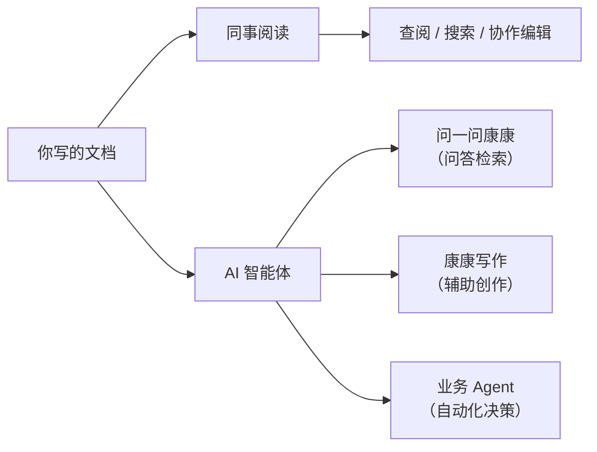

# 欢迎使用 FORCOME 知识库

FORCOME 知识库是公司的**人机协作知识平台**。这里汇聚的每一篇文档，不仅服务于团队成员的日常查阅，也是各类 AI 智能体（Agent）的知识来源——当你向 AI 提问、让 AI 帮你写文档或辅助决策时，它读取的正是这个平台上的内容。

**写好文档 = 训练你的 AI 同事。** 文档越完整、结构越清晰，AI 的回答就越准确、越有用。

【占位：知识库首页全貌截图】

::: info 访问方式
知识库仅对公司内部开放，使用**钉钉账号一键登录**即可访问。
:::

## 人机协作：文档的双重价值

你写的每篇文档，同时服务两类读者：



| 能力 | 面向人 | 面向 AI |
|------|--------|---------|
| 查阅文档 | 浏览业务知识、操作手册和常见问题 | Agent 检索知识库回答用户提问 |
| 全文搜索 | 关键词快速定位 | 语义检索 + 多路混合排序 |
| AI 问答 | 自然语言提问，获得带来源引用的回答 | RAG 管道自动匹配最相关文档片段 |
| 协作编辑 | 多人实时编辑，评论与版本历史 | — |
| 康康写作 | AI 写作助手：起草、润色、翻译 | 读取当前页面上下文辅助创作 |

## 内容组织方式

知识库按四级层次组织内容，权限沿层级继承并逐级收窄：

```markmap
# FORCOME 知识库
## 空间（Space）
### 目录（Directory）
#### 主题（Topic）
##### 页面（Page）
##### 子页面
#### 主题 B
### 目录 B
## 空间 B
```

| 层级 | 说明 | 示例 |
|------|------|------|
| **空间** | 顶层分区，对应一个业务域 | "企业应用"、"IT 服务" |
| **目录** | 空间下的分类文件夹 | "金蝶 ERP"、"网络管理" |
| **主题** | 目录下的子分类标签 | "财务模块"、"VPN 配置" |
| **页面** | 实际的文档，可嵌套子页面 | "凭证录入操作手册" |

详细权限规则见 [协作与权限](/zh/guide/collaboration)。

## 知识目录

### 业务部门

| 部门 | 涵盖内容 |
|------|----------|
| **IT 服务** | 系统运维、网络管理、设备申请、故障排查 |
| **财务** | 报销流程、财务制度、预算管理、税务合规 |
| **行政** | 办公规范、会议管理、资产管理、后勤服务 |
| **销售** | 客户管理、销售流程、合同模板、业绩考核 |
| **采购** | 采购流程、供应商管理、比价规范、验收标准 |
| **产品** | 产品规划、需求文档、原型设计、版本记录 |
| **供应链** | 仓储管理、物流配送、库存盘点、供应商协同 |

### 企业应用

- [金蝶 ERP](/zh/enterprise/kingdee/) — 财务核算、供应链、生产管理
- [CRM 系统](/zh/enterprise/crm/) — 客户关系管理
- [OA 办公](/zh/enterprise/oa/) — 流程审批、考勤管理

### AI 工具与学习

- [智能财务](/zh/ai-apps/finance/) — AI 辅助记账、对账
- [智能 PPT](/zh/ai-apps/ppt/) — AI 生成演示文稿
- **AI 学习** — 大模型基础、Prompt 工程、AI 应用实战

## 快速上手

第一次使用？阅读 [快速入门](/zh/quickstart) 了解核心操作。

## 写好文档的小建议

你写的每篇文档都可能被 AI 读取并用于回答同事的提问。以下习惯能让文档对人和 AI 都更友好：

- **加上清晰的标题层级** — AI 按章节理解文档，标题是最重要的导航信号
- **开头写结论** — 先说"是什么、怎么做"，再展开背景和细节
- **用列表和表格** — 结构化内容比大段文字更容易被精确检索
- **避免纯截图** — 截图中的文字 AI 无法读取，关键信息请用文字补充
- **保持更新** — 过时的文档会导致 AI 给出错误答案
- **放对位置** — 将文档归入正确的空间、目录和主题，方便同事和 AI 定位
