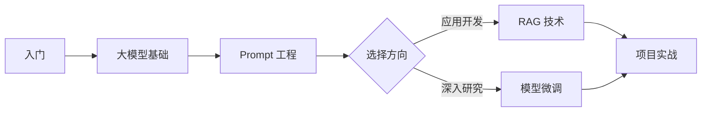

# 学习路径

推荐的学习顺序。

## 大模型学习路径

1. [什么是大模型](/zh/learning/llm/intro) - 基础概念
2. [Prompt 工程](/zh/learning/llm/prompt) - 提示词技巧
3. [RAG 技术](/zh/learning/llm/rag) - 检索增强生成

## 学习路线图（脑图）

```markmap
# AI 学习路径
## 基础知识
### 什么是大模型
### Transformer 架构
### 预训练与微调
## 实践技能
### Prompt 工程
#### 基础技巧
#### 高级技巧
### RAG 技术
#### 向量数据库
#### 检索策略
## 应用开发
### API 调用
### Agent 开发
```

## 学习流程（流程图）


